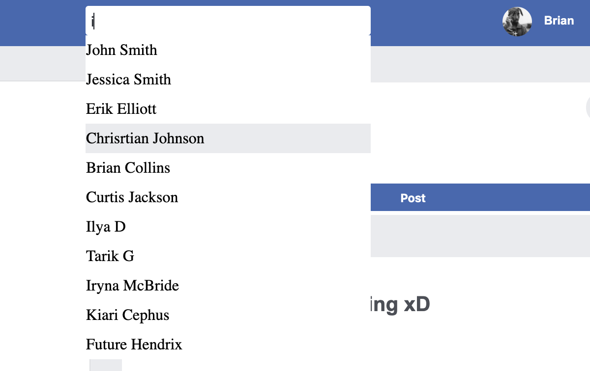
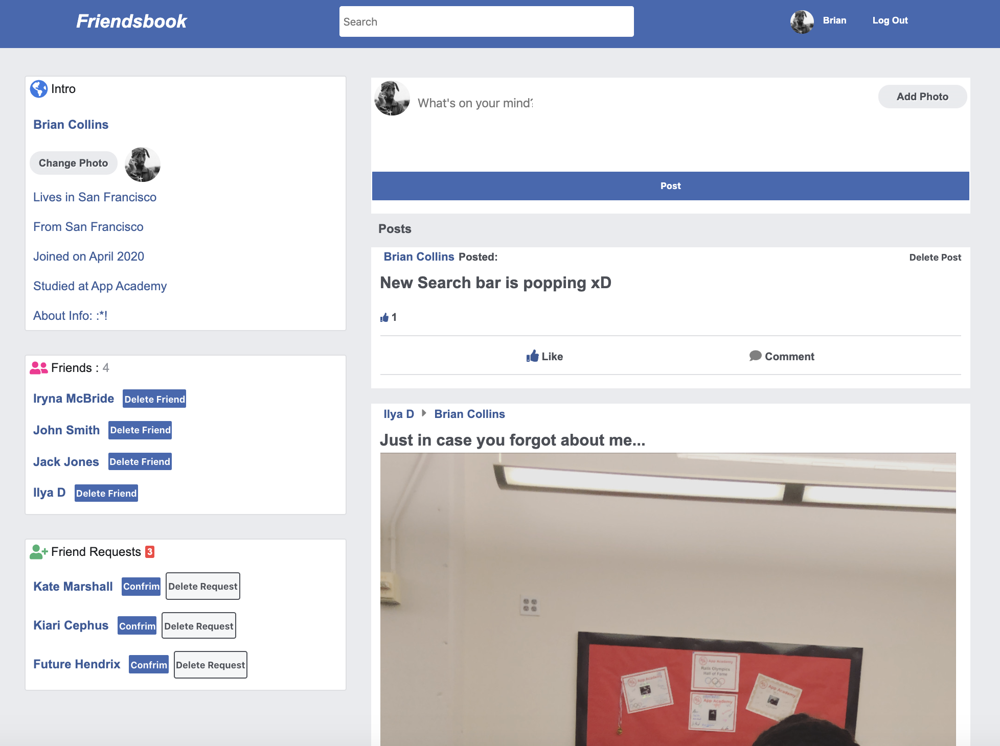

# Friendsbook

Friendsbook is a social networking website where users can post comments, share photographs and post links to news or other interesting content on the web and watch short-form video. 

See it live: https://fcbkclone.herokuapp.com/#/


## List of Technologies:

* Front-end:
  - React
  - Redux
  - CSS3
* Back-end:
  - Ruby on Rails
  - PostgreSQL
  - AWS
  
## Example:

### Adding/Deleting friends: 

You add friends by visiting their page and making a friend request. They then have an option of rejecting or accepting a request. If the request is accepted, then the two of you become friends. To remove a friends, just click 'Delete' button next to the friend's name.


Friends controller:

```ruby
def create 

  @friend = Friend.new(user_id: current_user.id, friend_id: params[:id])   
  @friend_request = FriendRequest.find_by(user_id: current_user.id, friend_id: params[:id])
  @opposite_friend = Friend.new(user_id: params[:id], friend_id: current_user.id)
  @opposite_friend_request = FriendRequest.find_by(user_id: params[:id], friend_id: current_user.id)

 begin 
  Friend.transaction do
    @friend.save
    @opposite_friend.save
    @friend_request.destroy if @friend_request 
    @opposite_friend_request.destroy if @opposite_friend_request

    render :create, status: 200

  end
  rescue ActiveRecord::RecordInvalid => exception
    flash.now[:errors] = @friend.errors.full_messages
    render json: @friend.errors.full_messages, status: 422
  end
end
```
Users reducer:

```ruby
switch (action.type) {
        case RECEIVE_CURRENT_USER:
            userId = Number(Object.keys(action.currentUser.users)[0])
            newState[userId] = action.currentUser.users[userId];
            return Object.assign(newState, action.currentUser.otherUsers);
        case RECEIVE_USER:
            return Object.assign(newState, action.user.users, action.user.otherUsers);
        case REMOVE_FRIEND:
            friendIdx = newState[action.friend.userId].friends.indexOf(action.friend.friendId);
            newState[action.friend.userId].friends.splice(friendIdx, 1);
            userIdx = newState[action.friend.friendId].friends.indexOf(action.friend.userId);
            newState[action.friend.friendId].friends.splice(userIdx, 1);
            return newState;
        case SEND_FRIEND_REQUEST:
            newState[action.data.friendId].friendRequests.push(action.data.userId)
            return newState;
        case REMOVE_FRIEND_REQUEST:
            userIdx = newState[action.data.friendId].friendRequests.indexOf(action.data.userId);
            newState[action.data.friendId].friendRequests.splice(userIdx, 1);
            return newState;
        case ADD_FRIEND:
            newState[action.friendId.userId].friends.push(action.friendId.friendId)
            newState[action.friendId.friendId].friends.push(action.friendId.userId)
            userIdx = newState[action.friendId.userId].friendRequests.indexOf(action.friendId.friendId);
            newState[action.friendId.userId].friendRequests.splice(userIdx, 1);
            return newState;
        default:
            return state;
    }
```

### Find people through Search:

In the navbar there is an autocomplete search box, that displays all the names that have a partial match to your search term.



Search controller:

```ruby
 def index

        @users = User.where("first_name ILIKE ? ", "%#{params[:search_key]}%").or(User.where("last_name ILIKE ? ", "%#{params[:search_key]}%"))
       
        if @users
            render :index
        else 
            flash.now[:errors] = ['Cant find anything']
            render json: ['Cant find anything'], status: :not_found
        end

    end
    
end
```
On blur search result are being cleared:

```javascript
   render() {

        return (
            <div className="search">
                    <input type="text"
                    value={this.state.searchKey}
                    onChange={this.handleChange}
                    placeholder="Search"
                    className="search-bar"
                    onBlur={this.handleBlur}
                    />
                    <div className="search-results">
                {
                    this.props.users.map(user =>
                    <SearchItem
                        user={user}
                        key={user.id} 
                        clearSearch={this.clearSearch} />)
                }
                    </div>
            </div>
        )
    }
```

### Users can leave posts on each other's walls as well as on their own, comment on posts, like posts and comments and post pictures:



## Future Features:

* Users can post videos on each other's walls
* Users can edit existing posts and comments

## Creator:

[Iryna McBride](https://www.linkedin.com/in/iryna-mcbride/)
